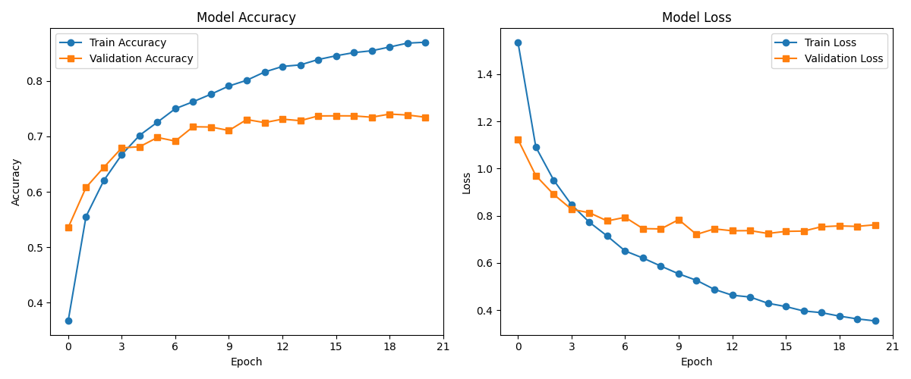
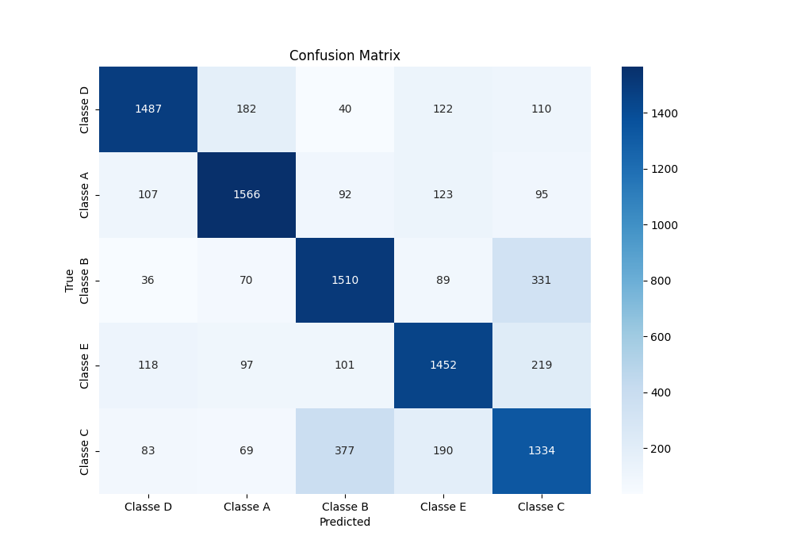

# 🚀 Projeto de Manutenção Preditiva com IA

<div style="display: inline_block">
  
</div>

Este projeto visa desenvolver um sistema de manutenção preditiva para uma indústria de grande porte localizada em Santa Catarina. Utilizando técnicas de aprendizado de máquina e análise de dados, o objetivo é prever falhas em máquinas e equipamentos, evitando paradas não planejadas e otimizando a gestão de ativos.

## 📄 Descrição

1. **Coleta de Dados:** Dados de sensores instalados em uma máquinas foram coletados e armazenados em um banco de dados pela empresa. Os dados foram fornecido através de arquivos de extensão `.npy` e estão na pasta [dados](./dados).
>- **Sensores:** Este projeto utiliza dados provenientes de 5 sensores diferentes. Cada sensor coleta aproximadamente 200 sinais com uma taxa de amostragem de 10kHz.
2. **Análise exploratória dos dados:** Os dados foram analizados para entender sua distribuição e identificar padrões iniciais.
3. **Preparação dos Dados:** Os dados foram normalizados e organizados em um DataFrame do Pandas. As classes foram mapeadas para valores numéricos.
4. **Divisão dos Dados:** Os dados foram divididos em conjuntos de treino e teste utilizando train_test_split do scikit-learn
5. **Implementação do Modelo:** Uma rede neural foi implementada usando TensorFlow.
6. **Treinamento do Modelo:** Foi elaborada uma parada antecipada para que a rede não fique especializada nos dados de treinamento.
7. **Avaliação do Modelo:** A performance do modelo foi avaliada no conjunto de teste, garantindo que ele generalize bem para novos dados. Em alguns testes atingiu uma acurácia de mais de 70%.
8. **Visualização dos Resultados:** Resultados e métricas de performance foram visualizados para facilitar a interpretação e tomada de decisão.

## 📚 Índice

- Instalação
- Uso
- Funcionalidades
- Contribuição
- Licença
- Contato

## 🛠️ Instalação

Siga os passos abaixo para configurar o ambiente e instalar as dependências necessárias:

```bash
# Clone o repositório
git clone https://github.com/dionvargas/senai-caso.git

# Entre no diretório do projeto
cd senai-caso

# Crie um ambiente virtual
python -m venv venv

# Ative o ambiente virtual
# No Windows
venv\Scripts\activate
# No macOS/Linux
source venv/bin/activate

# Instale as dependências
pip install -r requirements.txt
```

## 🚀 Uso
O projeto está dividido em duas partes.

### Interface Web
Foi elaborada uma interface web para visualização dos dados. Nessa interface é possível ver as principais informações do dataset fornecido pela empresa.

``` bash
# Execute o arquivo app.py com python
python app.py
```
Abra um navegador no diretório: [http://127.0.0.1:5000/](http://127.0.0.1:5000/)

### Algoritmo de aprendizado de máquina
Implementação e treinamento de uma rede neural para resolução do problema.
``` bash
# Execute o arquivo __init__.py com python
python __init__.py
```

## ✨ Funcionalidades
- Análise exploratória dos dados.
- Treinamento e avaliação de modelos de machine learning.
- Classificação de sinais de sensores em 5 classes distintas.

## 🤝 Resultados
Foi usado uma parada antecipada para que a rede não se especialize nos dados de treinamento. Abaixo é apresentada as curvas acurácia e de perda dos dados de treinamento e validação.


Por fim a matrix confusão dos dados de teste.


A arquitetura proposta atingiu uma acurácia de 73.49% no conjunto de testes.

## 📜 Licença
Este projeto está licenciado sob a Licença MIT - veja o arquivo [LICENSE](./LICENSE) para mais detalhes.

## 📞 Contato
Dionathan Luan de Vargas - [@dionvargas](https://github.com/dionvargas) - dionathan_vargas@hotmail.com

Link do Projeto: https://github.com/dionvargas/senai-caso